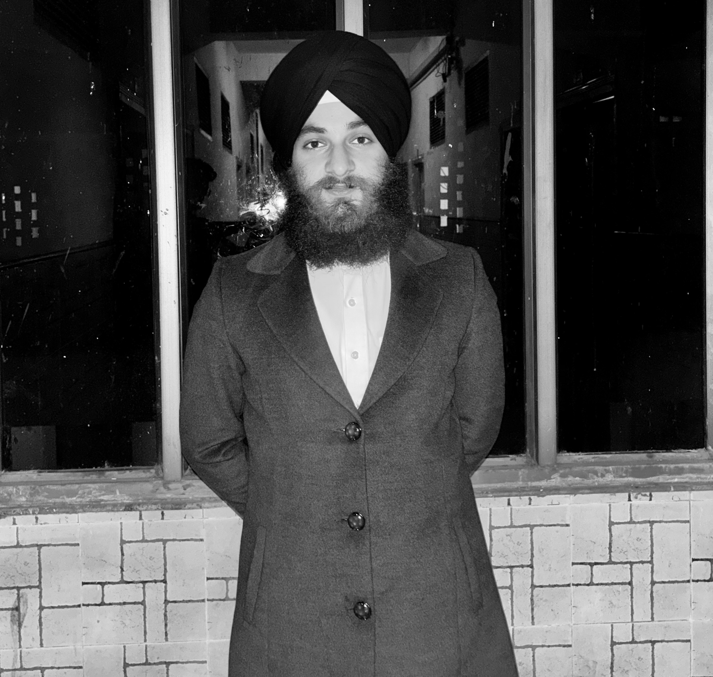

# Jeet Ashwar Singh 




### Biotechnology Student • DL/ML Researcher • Genomics & Cancer Research Enthusiast

I'm a **B.Tech Biotechnology student at Dr. B. R. Ambedkar National Institute of Technology, Jalandhar (NIT Jalandhar)**, interested in both the **experimental and computational sides of biotechnology**.

I enjoy working with **Machine Learning, Deep Learning, Computer Vision, Genomics, and biological data**, but I also want to build strong hands-on experience in **wet-lab research and core biotechnology**.

My research interests currently include **tissue culture, 
genomics, cancer biology**,

**molecular biology, and biotechnology**, along with computational approaches that can help us understand biological systems better.

At the same time, I'm working on AI-based research involving physiological signals, computer vision, multimodal learning, and healthcare applications.

**I don't want to be limited to either biology or AI. I want to understand the biology, work with it in the lab, and use computation when it can help answer better questions.**

<br clear="right"/>

---

##  What I'm Interested In

My interests sit across both **wet-lab biotechnology and computational research**.

###   Core Biotechnology & Wet Lab

*  **Genomics**
*  **Animal & Plant Tissue Culture**
*  **Molecular Biology**
*  **Cancer Biology & Cancer Research**
*  **Plant Biotechnology**

###  Computational & AI Research

*  **Machine Learning & Deep Learning**
*  **Computer Vision**
*  **Computational biology**
*  **Biomedical Signal Processing**
*  **Pharmacogenomics**

I'm particularly interested in research where **experimental biology, genomics, and computational methods can complement each other**.

---

#  Research

## Multimodal Engagement Analysis — IIT Ropar

**Research Intern · Dr. Puneet Kumar**

Currently working on **multimodal engagement analysis** and affective computing.

My work involves:

* Facial Action Unit (AU) analysis
* Micro-expression detection and representation
* Facial feature extraction
* Temporal alignment of multimodal signals
* Remote photoplethysmography (**rPPG**)
* Multimodal signal fusion
* TCN/CNN-based deep learning models
* Joint learning of engagement and micro-expression representations
* Experimental evaluation and research documentation

This work has given me experience working with **biological/physiological signals, computer vision, deep learning, and multimodal data**.

---

#  Biotechnology & Wet-Lab Interests

While I enjoy building computational systems, I don't want my biotechnology journey to remain entirely behind a computer.

I want to gain more hands-on experience in **core biotechnology and wet-lab research**, particularly in areas such as:

###  Tissue Culture

I'm  learning and working with **plant and animal tissue culture**, cell culture systems, aseptic techniques, media preparation, cell maintenance, and experimental design.

### Genomics

I'm interested in **genomics, genome analysis, sequencing data, genetic variation, and computational analysis of genomic datasets**.

### Cancer Research

Cancer biology is another area I want to explore, particularly where **molecular biology, genomics, cell culture, and computational analysis** come together.

My long-term interest is in understanding biological problems experimentally and then using computational tools to extract more information from the data.

---

# Projects

## [Bubble Column Photobioreactor Optimizer](https://github.com/JeetAshwarSingh/BubbleColumnPhotoBioreactorOptimizer)

**Python · Scikit-learn · Pandas · Streamlit**

A project where I combined **biotechnology and machine learning** to study microalgal biomass production in Bubble Column Photobioreactors.

### What I did

* Performed exploratory data analysis
* Used **PCA** to investigate cultivation states
* Applied the **Elbow Method** to identify growth regimes
* Investigated nitrate depletion and pH flux as factors affecting biomass accumulation
* Built and tuned a **Random Forest Regressor**
* Achieved **R² = 0.986**
* Outperformed published linear and Gaussian baselines by **4.8%**
* Built a Streamlit dashboard for model inference

---

## [HeartVision](https://github.com/JeetAshwarSingh/HeartVision) — Real-Time rPPG Heart Rate Estimation

**Python · OpenCV · NumPy · SciPy**

HeartVision is a contactless heart-rate estimation system that extracts physiological information from ordinary webcam video.

The project uses **remote photoplethysmography (rPPG)** to estimate heart rate without requiring a physical sensor.

### Highlights

* Implemented the **Plane-Orthogonal-to-Skin (POS)** algorithm
* Extracted Blood Volume Pulse from webcam video
* OpenFace / Haar Cascade ROI pipelines
* Fourth-order Butterworth bandpass filtering
* FFT-based physiological frequency analysis
* SNR and periodicity-based signal validation
* Physiological frequency range of approximately **45–200 BPM**
* Automated HTML reports using Matplotlib and Pandas

---

## [FedBlock](https://github.com/JeetAshwarSingh/FedBlock) — Privacy-Preserving Healthcare AI

**Python · Scikit-learn · NumPy · Cryptography**

FedBlock explores how healthcare institutions could collaboratively train machine-learning models without directly sharing sensitive patient data.

### What I implemented

* **Federated Averaging (FedAvg)**
* Three simulated hospital nodes
* Non-IID data distributions
* Proof-of-Authority audit mechanism
* Cryptographic model-weight hashes
* Round and node-token logging
* Convergence comparison with centralized training

---

#  Technical Skills

### AI & Machine Learning

`Python` · `Machine Learning` · `Deep Learning` · `Supervised Learning` · `Unsupervised Learning` · `Feature Engineering` · `Model Evaluation` · `Federated Learning` · `Multimodal Learning`

### Biotechnology

`Plant Tissue Culture` · `SDS-PAGE` · `Gel Electrophoresis` · `DNA Isolation` · `Enzyme Immobilisation` · `Bioprocess Engineering` · `HPLC`

### Computer Vision & Signals

`Computer Vision` · `OpenCV` · `rPPG` · `Signal Processing` · `Physiological Signal Analysis`

### Data & Scientific Computing

`NumPy` · `Pandas` · `Scikit-learn` · `EDA` · `Data Preprocessing` · `Statistical Analysis`

###  Tools

`Git` · `GitHub` · `Kaggle` · `Jupyter Notebook` · `Streamlit`

---

# What I am Exploring

I'm especially interested in opportunities where I can work on **real biological problems**, rather than only benchmark datasets.

I'm looking for opportunities to learn and contribute in areas such as:

**Genomics · Cancer Research · Tissue Culture · Molecular Biology · Cell Culture · Biotechnology · Computational Genomics · Biomedical AI · Machine Learning for Biology**

I'm particularly interested in research environments where I can **work in the wet lab, understand the experimental process, analyse the resulting data, and eventually connect both sides**.

---

#  Achievements

*  **Winner** — Data Science Competition, Revamping Biotechnology, Utkansh Fest, NIT Jalandhar
*  **Second Prize** — Pre-AI Summit: Hackathon on AI for Social Good, IIT Ropar
*  **2nd Runner-Up** — CosmoHack 2025, National-level Hackathon, Guru Nanak Dev University, Amritsar

---

#  Currently Exploring

```text
                         BIOTECHNOLOGY
                              │
             ┌────────────────┴────────────────┐
             │                                 │
        WET LAB                         COMPUTATIONAL
             │                                 │
     ┌───────┼────────┐               ┌────────┼────────┐
     │       │        │               │        │        │
 Tissue   Genomics  Cancer         Genomics   AI/ML   Computer
 Culture   Biology  Research       Analysis          Vision
     │       │        │               │        │        │
     └───────┴────────┴───────────────┴────────┴────────┘
                              │
                       BIOLOGICAL RESEARCH
                              │
                   Better Questions + Better Data
```

---

# Let's Connect

I'm always happy to talk about **biotechnology, genomics, cancer research, tissue culture, AI/ML, computational biology, biomedical AI, research internships, or interesting research projects**.

* **LinkedIn:** [linkedin.com/in/jeet-ashwar-singh-6758b1350](https://www.linkedin.com/in/jeet-ashwar-singh-6758b1350)
* 💻 **GitHub:** [github.com/JeetAshwarSingh](https://github.com/JeetAshwarSingh)
* 📧 **Email:** [jeetashwarsingh@gmail.com](mailto:jeetashwarsingh@gmail.com), [jeetas.bt.24@nitj.ac.in](mailto:jeetas.bt.24@nitj.ac.in)

---

<div align="center">

### Biology first. Computation when it helps.

*Biotechnology student exploring both the wet lab and the world of AI.*

</div>
